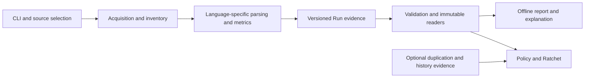

# Architecture: from source to inspectable evidence

Metrolith's CLI coordinates acquisition, inventory, language-specific measurement
and evidence writing. Consumers then validate and derive reports or evaluate
explicit user rules. This page describes the implementation; linked contracts
define the normative semantics.

1. **Select and acquire.** [pipeline.py](../pipeline.py) and
   [CLI handlers](../modules/cli/) dispatch requests. [Local source](../modules/local_source.py),
   [revision source](../modules/revision_source.py) and [acquisition](../modules/acquisition.py)
   distinguish directory/working snapshots from committed Git objects. Outputs,
   caches and temporary materializations belong to the selected workspace.
2. **Account for scope.** [Inventory](../modules/inventory.py) applies versioned
   exclusions and records inclusion reasons, encoding and dialect evidence.
   [Source frontend](../modules/source_frontend.py) shares parser selection between
   consumers; it does not decide inclusion or write metrics.
3. **Parse and measure.** Python uses CPython `ast`; Java, JavaScript, TypeScript/TSX
   and Go use their respective Tree-sitter grammars. Shared orchestration does
   not imply a universal parser or identical language capabilities.
   [Core metrics](../modules/core_metrics.py), [syntax predicates](../modules/syntax_predicates.py),
   [callable analysis](../modules/callable_analysis/) and the
   [callable ledger](../modules/callable_ledger.py) define populations and aggregation.
   JavaScript/TypeScript recovery remains explicit in diagnostics; see the
   [compatibility contract](JAVASCRIPT_COMPATIBILITY_FALLBACK.md).
4. **Persist evidence.** [Run artifacts](../modules/run_artifacts.py),
   [summary](../modules/summary.py) and per-subject outputs retain source identity,
   contracts, measurements and diagnostic states. [Artifact contracts](ARTIFACT_CONTRACTS_V35.md)
   and the [metric](METRIC_CONTRACT_V3.md)/[complexity](COMPLEXITY_CONTRACT_V2.md)
   contracts define what those values mean.
5. **Read and validate.** [Artifact readers](../validation/artifact_io/) and
   [validation](../validation/scripts/validate_outputs.py) check structure and
   cross-file consistency. Versioned [schemas](../validation/resources/schemas/)
   and independently retained conformance fixtures constrain producer behavior.
   A current producer's output is not an independent correctness oracle.
6. **Derive and evaluate.** [Report View](../modules/report_view.py),
   [presentation](../modules/presentation.py) and [Dossier](../modules/dossier.py)
   create derived views. [Policy](../modules/policy/) and [Ratchet](../modules/ratchet/)
   admit matching evidence before evaluating user-selected rules. Optional
   [duplication](../modules/duplication/), [Hotspots](../modules/hotspots.py) and
   [Changed Code](../modules/changed_code.py) have separate evidence contracts.

## Boundaries that matter

**State is separate from value.** Zero counted classes and unavailable class
measurement are different observations. Keeping status alongside value prevents
a consumer from treating missing evidence as success. This is visible in both
the contracts and admission code, not a quality score inferred by the UI.

**Evidence is separate from presentation.** HTML reports, Story/Explorer and
Dossiers are derived views. They cannot replace the authoritative inputs used
to make them. The hosted application is separately implemented and is not part
of the installed CLI architecture.

**Validation is separate from trust.** A structurally and semantically consistent
Run is not proof that its claimed source was honestly acquired. Protected Policy
evaluation binds independently controlled evaluator/source identities and
evidence receipts. [Usage](USAGE.md#author-and-evaluate-policy) explains the
local versus protected boundary.

As an engineering interpretation, shared selection and immutable readers reduce
opportunities for producer/consumer drift; they do not establish parser completeness
or universal cross-language comparability. The [reproducibility guide](REPRODUCIBILITY.md)
states the narrower equality guarantees.
